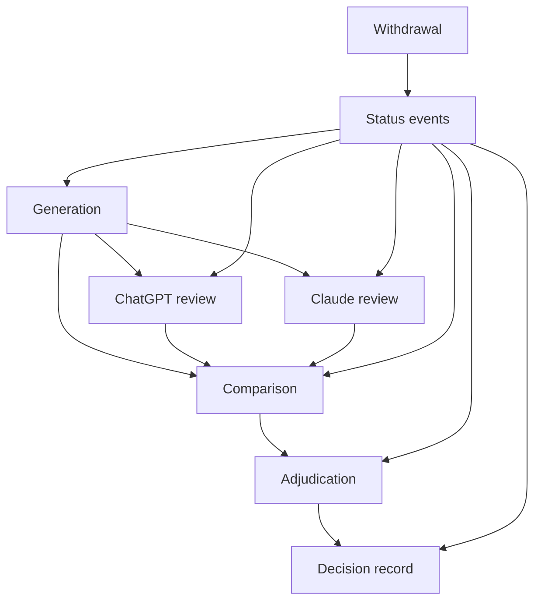

# Immutable Scoring Lineage and Withdrawal Invalidation Design

**Status:** ChatGPT architecture decision for Claude Code verification  
**Applies after:** Phase E Tier 3 commit `48ab66b`  
**Implementation scope:** synthetic dummy records only until a later joint readiness approval

## Tier 3 verification

Commit `48ab66b` closes the Tier 3 behavioral findings: the seal gate executes before holdout access, both private permissions are required, pre-adjudicated fields are constrained, chronology is strengthened, raw manifest mutation paths are removed, private loaders reject duplicate keys and IDs, and source/pair/rubric transitions are enforced.

One non-behavioral cleanup remains: the `validate_manifest_collection()` docstring still describes `--milestone`/`--reason` as the authorization for `pilot_mode=False`. The implementation correctly uses an approved seal declaration instead. Update that stale paragraph while implementing this design.

## Goals

1. Preserve every generation, independent review, comparison, adjudication, and decision as an immutable artifact.
2. Make every semantic score traceable to the exact generation, rubric, dataset, checkpoint, and prompt contract it evaluated.
3. Prevent an unscored, superseded, invalidated, or withdrawn result from guiding a model or release decision.
4. Remove private source-derived artifacts after withdrawal while retaining a content-free audit trail.
5. Make interrupted withdrawal operations safely resumable without ever reactivating the record.

## Non-goals

- No automated semantic judge.
- No real-note collection or pilot authorization.
- No holdout-seal schema implementation in this phase.
- No public release of private artifacts.
- No in-place correction of immutable evaluation artifacts.

## Artifact graph

Comparison is computed from the two reviews. Withdrawal invalidates the entire descendant closure of every generation containing the withdrawn record.

## Artifact kinds and paths

Keep the approved generation locations and add lineage beneath them.

### Validation

- Generation: `training/results/private/real_validation/<evaluation_id>.json`
- Reviews: `training/results/private/real_validation/lineage/<evaluation_id>/reviews/<review_id>.json`
- Comparisons: `training/results/private/real_validation/lineage/<evaluation_id>/comparisons/<comparison_id>.json`
- Adjudications: `training/results/private/real_validation/lineage/<evaluation_id>/adjudications/<adjudication_id>.json`

### Holdout

- Generation: `training/results/private/real_holdout/<milestone>/<evaluation_id>.json`
- Lineage: `training/results/private/real_holdout/<milestone>/lineage/<evaluation_id>/...`

### Global private audit

- Status events: `training/results/private/audit/status_events/<status_event_id>.json`
- Withdrawal plans/completions: `training/results/private/audit/withdrawals/<withdrawal_id>/plan.json` and `completion.json`
- Dataset snapshots: `training/results/private/audit/dataset_snapshots/<split>/<snapshot_id>.json`
- Decision records: `training/results/private/decisions/<decision_id>.json`

All paths are already beneath the gitignored private result root. Path construction still uses safe identifiers and split-specific root validation.

## Common integrity contract

Every artifact:

- has a fixed schema version and artifact kind;
- uses a random 32-hex identifier with a kind-specific prefix;
- has an RFC 3339 UTC creation timestamp;
- contains an `artifact_fingerprint` equal to SHA-256 of canonical JSON after omitting that field;
- is written with exclusive-create semantics;
- rejects duplicate JSON keys, unknown fields, malformed IDs, malformed fingerprints, and non-UTC timestamps; and
- is verified on every load before use.

Parent references contain `artifact_id`, `artifact_kind`, and `artifact_fingerprint`. A child fails closed if its parent is missing, fingerprint-mismatched, wrong-kind, superseded, or invalidated.

No artifact is edited to change status. Status is derived from immutable status events.

## 1. Generation artifact

Replace the mixed raw-plus-null-score shape with `real-eval-generation-v1`. No real artifacts exist yet, so a clean schema replacement is safer than maintaining an ambiguous compatibility mode.

Required top-level fields:

- `schema_version`, `artifact_kind: generation`, `evaluation_id`, timestamp;
- split, optional release milestone, evaluation reason, and repository commit;
- checkpoint path/fingerprint, training seed, and run ID;
- dataset fingerprint, record count, and rubric schema version;
- prompt-contract version and fingerprint once synchronized;
- generation configuration;
- record results;
- format-valid aggregate; and
- artifact fingerprint.

Each record result contains:

- record ID;
- source, pair, and rubric fingerprints;
- raw generated output;
- raw-output fingerprint computed from canonical `{"raw_output": <exact string>}`;
- literal format-valid boolean.

Generation artifacts contain no semantic scores, review status, failure labels, or adjudication placeholders.

## 2. Independent review artifact

Schema: `real-eval-review-v1`.

Required fields:

- review ID and artifact fingerprint;
- exact generation parent reference;
- reviewer role, exactly `chatgpt` or `claude`; stable reviewer actor ID;
- independent-review attestation that the other review was not consulted first;
- creation timestamp;
- exact dataset, rubric-schema, checkpoint, and prompt-contract fingerprints copied from the verified generation;
- one complete score record for every generation record, no omissions or extras;
- optional private review notes that minimize quotation of source-derived text;
- optional `supersedes_review` reference for a correction.

Each score record binds:

- record ID;
- generation raw-output fingerprint;
- rubric fingerprint;
- format validity copied exactly from generation;
- all four literal boolean semantic dimensions;
- capability checks whose keys exactly match the private rubric;
- deduplicated failure labels from the frozen vocabulary;
- computed strict pass.

The builder computes strict pass and rejects caller-supplied inconsistencies. A partial or null-scored review cannot be saved as complete evidence.

Corrections create a new review artifact and immutable supersession event. The earlier review remains historically present unless later deleted by withdrawal.

## 3. Comparison artifact

Schema: `real-eval-comparison-v1`. Generated by code, not manually authored.

It requires exactly one active ChatGPT review and one active Claude review that:

- share the exact generation parent;
- cover the same record IDs;
- bind the same raw-output and rubric fingerprints; and
- use distinct reviewer roles and actor IDs.

The comparison records every disagreement in semantic dimensions, capability checks, failure labels, and strict pass. It contains no raw note or generated-output text.

`alignment_status` is:

- `aligned` only when every decision-relevant field matches; or
- `disagreement` otherwise.

## 4. Adjudication artifact

Schema: `real-eval-adjudication-v1`.

It references the generation, both reviews, and comparison by ID and fingerprint.

Resolution modes:

- `reviewer_agreement`: comparison is aligned and final results exactly match both reviews;
- `product_owner_resolution`: comparison contains disagreement and a product-owner actor resolves the disputed fields after both reviewers report the disagreement.

The final artifact contains complete record scores, failure labels, strict passes, and aggregate strict pass. Every value is computed or validated against its parents.

No result may guide curriculum, seed, checkpoint, model, or release decisions until an active adjudication artifact exists.

## 5. Decision record

Schema: `real-eval-decision-v1`.

Before a real-data result influences a decision, create a private decision record containing:

- decision ID, type, timestamp, and deciding actor;
- one or more active adjudication references;
- decision outcome in non-sensitive language;
- optional repository document or commit reference;
- artifact fingerprint.

Allowed decision types initially: `curriculum`, `training_budget`, `seed`, `checkpoint`, `prompt`, and `release`.

A decision cannot cite raw generation, individual review, or comparison artifacts directly. Withdrawal of any contributing record invalidates the entire decision record; it is not partially preserved as active evidence.

## 6. Status events

Schema: `real-lineage-status-v1`.

Each immutable status event contains:

- event ID and timestamp;
- target artifact reference;
- new status: `superseded` or `invalidated`;
- reason code;
- optional replacement artifact reference for supersession;
- optional withdrawal ID for withdrawal invalidation;
- actor ID;
- event fingerprint.

Consumers resolve status before using any artifact. File existence never implies validity.

Status transitions are one-way:

- active to superseded;
- active or superseded to invalidated;
- invalidated never returns to active.

## Withdrawal protocol

### Scope

Withdrawing one record invalidates every generation containing it, every descendant review/comparison/adjudication, and every decision based on those adjudications.

If a generation contains other records, the whole generation and lineage are invalidated and removed. Partial editing would violate immutability; unaffected records may be evaluated again in a new generation.

If the record belongs to holdout, the entire seal is retired. Nothing is automatically resealed.

### Public operation

Implement one entry point such as:

`withdraw_record_validated(record_id, requested_by_actor_id, reason_code, requested_at_utc)`

Allowed reason codes initially: `contributor_request` and `consent_expired`. Do not store note text or a free-form withdrawal explanation.

### Discovery and plan

Before mutation:

1. Acquire an exclusive record-scoped lock.
2. Strictly load the manifest, source split, rubrics, generation artifacts, lineage, status events, decisions, dataset snapshots, and seals.
3. Reject malformed artifacts rather than silently skipping them.
4. Verify the record ID occurs once in the manifest and its source fingerprint identifies at most one source row.
5. Compute the full descendant closure and affected decisions/seals.
6. Write an immutable withdrawal plan before deleting anything.

The plan contains IDs, artifact kinds, fingerprints, relative private paths, prior dataset fingerprint, affected seal/decision IDs, and the intended actions. It contains no note text, generated output, scores, labels, or reviewer notes.

### Execution order

1. Atomically update the manifest to `withdrawn` or `expired` with the event timestamp. This happens first so every future eligibility check fails even if later cleanup is interrupted.
2. Atomically remove the exact source row from its split when one exists.
3. Atomically remove the rubric entry.
4. Write invalidation status events for every affected generation, descendant, and decision.
5. Retire every affected holdout seal through an immutable seal-status event.
6. Delete the affected generation and lineage files after their invalidation events exist.
7. Delete other source-derived private artifacts identified by the plan.
8. Recompute and save a dataset snapshot for the remaining active split.
9. Run residual checks.
10. Write the immutable withdrawal completion artifact.
11. Release the lock.

### Residual checks

Completion requires proof that:

- the manifest record is terminal and ineligible;
- the source fingerprint no longer resolves to a row in either active source split;
- no rubric entry remains;
- no affected artifact remains usable;
- all affected decisions are invalidated;
- a holdout seal containing the record is retired;
- the remaining dataset fingerprint was recomputed;
- a repeated evaluation attempt fails before generation.

Deletion from active storage is best-effort deletion under the project policy; do not claim cryptographic erasure or backup deletion unless those systems were separately verified.

### Crash recovery and idempotency

- If a completion artifact exists, repeating the request returns that completion without further mutation.
- If a plan exists without completion, repeating the request resumes from the first unfinished step.
- Once the manifest becomes withdrawn or expired, recovery never rolls it back to active.
- Each status event and delete step is safe to repeat.
- A failure reports the pending withdrawal ID without quoting private content.
- A stale or ambiguous lock fails closed and requires explicit recovery; it is never silently removed.

## Dataset snapshots

Schema: `real-dataset-snapshot-v1`.

Each snapshot contains split, creation reason, active record IDs and their verified source/pair/rubric fingerprints, rubric schema version, computed dataset fingerprint, parent snapshot when one exists, timestamp, and artifact fingerprint.

Withdrawal completion references the before/after snapshot IDs. An empty remaining split still receives a deterministic empty-dataset fingerprint.

For holdout, the post-withdrawal snapshot is audit evidence only. The former seal remains retired and cannot be reused.

## Required adversarial tests

### Scoring lineage

1. Generation artifact contains no semantic-score placeholders.
2. Every artifact rejects overwrite, malformed IDs, unknown fields, duplicate keys, and fingerprint mismatch.
3. Review record set must exactly equal generation record set.
4. Review raw-output and rubric fingerprints must match generation.
5. Non-boolean, null, partial, missing, or extra scores fail.
6. Capability-check keys must exactly equal the rubric contract.
7. Unknown or duplicate failure labels fail.
8. ChatGPT and Claude reviewer roles and actor IDs must be distinct.
9. A comparison of different generations fails.
10. Any score/check/label disagreement produces `disagreement`.
11. `reviewer_agreement` adjudication fails unless comparison is fully aligned.
12. Product-owner adjudication is required for a disagreement.
13. Strict record and aggregate passes are recomputed, not trusted.
14. Superseded or invalidated parents cannot create new descendants.
15. A decision cannot cite anything except active adjudication artifacts.

### Withdrawal

16. Consent-only, de-identified, adjudicated, validation, and holdout records withdraw correctly for their lifecycle stage.
17. Duplicate/ambiguous source rows fail before mutation.
18. A multi-record generation is wholly invalidated when one record withdraws.
19. All descendant reviews, comparisons, adjudications, and decisions are discovered.
20. Invalidation events exist before source-derived artifacts are deleted.
21. Withdrawal retires every affected holdout seal.
22. Dataset fingerprint changes and an empty dataset remains deterministic.
23. No source or generated text appears in plan, status, snapshot, or completion artifacts.
24. Injected failure after every execution step leaves the record ineligible and the operation resumable.
25. Repeating a completed withdrawal is a no-op returning the same completion.
26. Terminal records cannot reactivate.
27. Malformed private artifacts fail closed instead of being skipped.
28. Residual evaluation attempts fail before model generation.
29. Active-storage artifacts are absent after completion.
30. Invalidated decision records cannot be used as current evidence.

## Implementation order

1. Correct the stale pilot-mode docstring.
2. Replace `real-eval-v1` with the immutable generation schema and artifact fingerprinting.
3. Add strict loaders/builders for reviews, comparisons, adjudications, status events, decisions, and snapshots.
4. Implement lineage validation and active-status resolution.
5. Implement the structured private real-validation evaluator using the generation schema.
6. Implement and test withdrawal discovery, planning, execution, recovery, and completion.
7. Run crash-injection and adversarial dummy drills.
8. Return for joint review before prompt synchronization or pilot population.

## Authorization boundary

Claude is authorized to implement this design using dummy records only.

This does not authorize real-note collection, validation-pilot population, holdout population/evaluation, a holdout-seal schema, prompt-contract changes, model training, checkpoint promotion, or release changes.

## Alignment request

Claude should report:

- **Aligned** and proceed with the dummy implementation; or
- **Not aligned** with the exact artifact, invariant, transition, deletion rule, or test in dispute.

No lineage-dependent implementation should proceed under an unreported disagreement.
